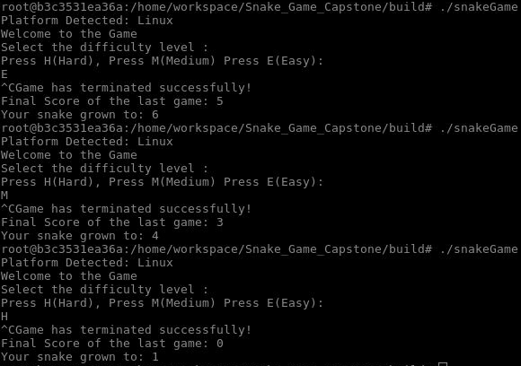
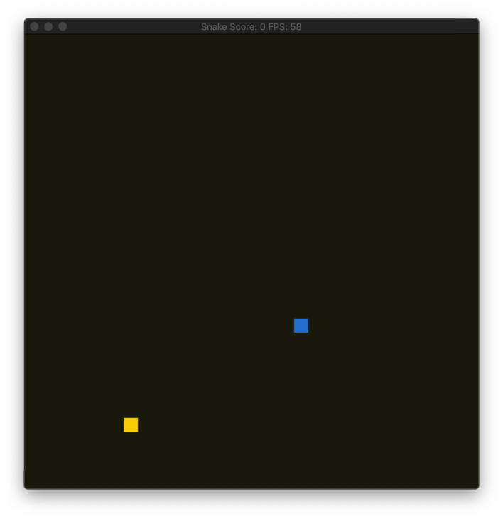
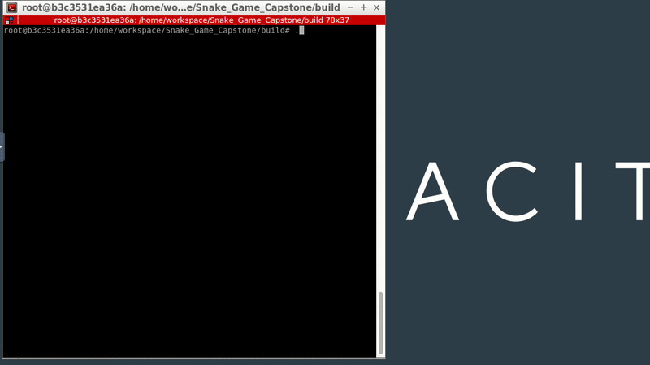

# 

## `Capstone Project: Snake Game`

## Overview

This repo includes the Capstone project in the [Udacity C++ Nanodegree Program](https://www.udacity.com/course/c-plus-plus-nanodegree--nd213).The source code has been heavily adapted from the provided starter code located at (Udacity's repo)[https://github.com/udacity/CppND-Capstone-Snake-Game].

## Introduction:
Once the game starts it creates the `Game`, `Controller`, and `Snake` objects, then game continues to loop through each component and simultaneously grabs input from the user, `Controller`, later it updates the state of the `Game`, and graphically renderers the state of the game, `Render`. This is the high level overview of the logic flow.

## Additional Functionality

When the game is launched, the user is first greeted with a warm welcome message and also the game detectes system platform which the user is running the game on.

Then the user is asked for the select a `level`. There are three different levels which user can start with: Easy (E), Medium (M) and Hard (H). Once the user has selected a particular level the `snake` speed is set to a particular  value and game continues.

Following image shows the output on the terminal, when the game is launched in all different levels.  

The game board launches after the user provides a valid level and the user is able to play the game by moving the snake around with the arrow keys.

## Results

### Easy Level

### Medium Level

### Hard Level

## Dependencies for Running Locally

- cmake >= 3.7
  - All OSes: [click here for installation instructions](https://cmake.org/install/)
- make >= 4.1 (Linux, Mac), 3.81 (Windows)
  - Linux: make is installed by default on most Linux distros
  - Mac: [install Xcode command line tools to get make](https://developer.apple.com/xcode/features/)
  - Windows: [Click here for installation instructions](http://gnuwin32.sourceforge.net/packages/make.htm)
- SDL2 >= 2.0
  - All installation instructions can be found [here](https://wiki.libsdl.org/Installation)
  - Note that for Linux, an `apt` or `apt-get` installation is preferred to building from source.
- gcc/g++ >= 5.4
  - Linux: gcc / g++ is installed by default on most Linux distros
  - Mac: same deal as make - [install Xcode command line tools](https://developer.apple.com/xcode/features/)
  - Windows: recommend using [MinGW](http://www.mingw.org/)

## Basic Build Instructions

1. Clone this repo using `https://github.com/vrushabhdesai/Capstone_Project_Snake_Game.git`
2. Make a build directory in the top level directory: `mkdir build && cd build`
3. Compile: `cmake .. && make`
4. Run it: `./snakeGame`.

## Criterias which support the Capstone Project:

|Criteria| Description|
|--------|------------|

|Loops, Functions,I/O |The user has the option to select the starting level which sets the speed of the snake. A Game class member function `UpdateStartSpeed` is called and this member function encapsulates the Game's private data member `snake` and calls the Snake class member function `SetStartingSpeed`.|

|The project accepts user input and processes the input| User Main Manu is the interactive interface with the game. GameManger.h class|

|The project uses Object Oriented Programming techniques.|To meet this requirement, a `Platform` class was created in `game.h` to hold information about the system platform.|

|Classes use appropriate access specifiers for class members.|The class uses member initialization lists and the member functions getPlatform and printPlatform to fetch and printout the user's detected system platform.|

|Classes abstract implementation details from their interfaces|The [C++ Guide by Google](https://google.github.io/styleguide/cppguide.html#Function_Comments) was used to for any needed documentation. An example can be found within `game.h` (Platform class member funtions) above the function declaration of `getPlatform` where a simple comment is used to describe what the function does.|

|The project makes use of references in function declarations|Project definies the function where references in declaraton are used: HeadDistanceTravel() in snake.h.|

